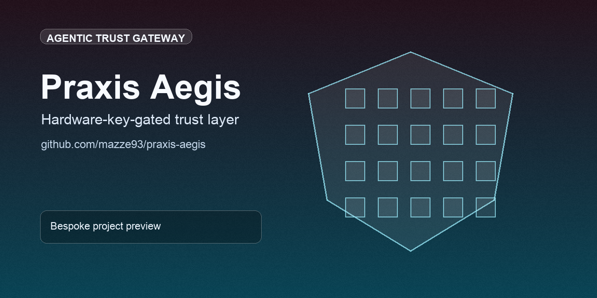

# praxis-aegis




praxis-aegis is a hardware-key-gated policy gateway between AI runtimes and real tools, enforcing identity, scope, quotas, and redaction before execution.

## At a glance
- Authenticate sessions with hardware security keys.
- Bind model actions to declared identity and policy tier.
- Enforce least privilege with deterministic gate checks.

## Quick links
- [The Problem](#the-problem)
- [What it enforces](#what-it-enforces)
- [Architecture](#architecture)

## GitHub social preview
Upload `.github/social-preview.png` in repository `Settings -> General -> Social preview` to use the branded card on link shares.

## The Problem

When you give an AI agent access to real tools — filesystem, APIs, messaging — the agent
acquires your context and your reach simultaneously. Prompt injection, model misbehavior,
or simple scope creep can act with your full authority. Without a chokepoint, you've handed
sovereignty to a process you don't control.

praxis-aegis is that chokepoint.

---

## What it enforces

**Authentication** — sessions require a hardware security key signature (YubiKey, Nitrokey,
Google Titan, or any SSH key). Not an API key. Not a password.

**Identity** — the model declares who it is acting as. The gateway verifies that declaration
matches the authenticated session. The model cannot escalate by claiming a different identity.

**Scope** — a policy matrix maps `identity × trigger × policy_set` to a tier:

| Tier | What it allows |
|------|---------------|
| T0_DENY | Nothing |
| T1_READONLY | `search_*`, `get_*`, `list_*` — up to 25 calls |
| T2_WRITE_SAFE | Explicitly allowlisted write tools only |
| T3_PRIVILEGED | Requires human approval (stub) |

**Quotas** — call counts and response byte limits per request sequence, enforced
synchronously to prevent races.

**Redaction** — tool responses are redacted before reaching the model: API keys, bearer
tokens, emails, SSNs, and anything exceeding the tier's byte limit. Backends receive raw
results; the model sees only what policy permits.

---

## Architecture

```
Model runtime / orchestrator
        │
        │  POST /invoke-tool  { request_id, tool_name, input, caller, meta }
        ▼
┌─────────────────────────────────────┐
│           praxis-aegis              │
│                                     │
│  1. Session verification (JWT)      │
│  2. Identity lock                   │
│  3. Policy resolution               │
│     identity + trigger → tier       │
│  4. Tool override evaluation        │
│  5. Caller verification (HMAC)      │
│  6. Tool allow/deny                 │
│  7. Quota check+increment (sync)    │
│  8. Backend invocation ─────────────┼──► tool backend (HTTP / local)
│  9. Response byte tracking          │
│  10. Output redaction               │
│                                     │
└─────────────────────────────────────┘
        │
        │  { ok, policy, tool_name, content }
        ▼
   Model runtime
```

Policy is a YAML file (`tool_risk_tier.yaml`). It is the source of truth — not the code.
Hot-reload via `POST /policy/reload` without restarting the server.

---

## Session flow

```bash
# 1. Request a challenge
curl -X POST localhost:8080/session/challenge \
  -H 'Content-Type: application/json' \
  -d '{"identity": "daedalus"}'
# → { challenge_id, nonce }

# 2. Sign the nonce with your hardware key
printf 'praxis-aegis:<nonce>' | ssh-keygen -Y sign -f ~/.ssh/id_ed25519 -n praxis-aegis
# → produces a .sig file

# 3. Submit the signature
curl -X POST localhost:8080/session/unlock \
  -H 'Content-Type: application/json' \
  -d '{"challenge_id": "...", "identity": "daedalus", "signature_b64": "<base64 sig>"}'
# → { session_token, expires_in_hours }

# 4. Use the session token for tool invocations
curl -X POST localhost:8080/invoke-tool \
  -H 'Authorization: Bearer <session_token>' \
  -H 'Content-Type: application/json' \
  -d '{
    "request_id": "req-abc123",
    "tool_name": "search_documents",
    "input": { "query": "praxis architecture" },
    "meta": { "identity": "daedalus", "trigger": "research" }
  }'
```

---

## Configuration

Required environment variables:

```bash
CALLER_HMAC_SECRET=<hex, min 32 chars>   # Signs caller tokens
SESSION_JWT_SECRET=<hex, min 32 chars>   # Signs session JWTs
```

Optional:

```bash
PORT=8080
POLICY_PATH=./tool_risk_tier.yaml
ALLOWED_SIGNERS_DIR=./allowed_signers
SESSION_TTL_HOURS=8
CHALLENGE_TTL_SECONDS=300
RATE_LIMIT_CHALLENGE_PER_MIN=10
SEARCH_SERVICE_URL=http://localhost:9001  # HTTP backend — register in server.ts
DATA_SERVICE_URL=http://localhost:9002
```

---

## Wiring backends

Register tool backends in `src/server.ts`:

```typescript
// HTTP backend — forwards { tool_name, input } to the service
toolRouter.register({
  match: /^search_/,
  backend: { type: "http", baseUrl: config.SEARCH_SERVICE_URL! }
});

// Local handler — inline TypeScript function
toolRouter.register({
  match: "ping",
  backend: { type: "local", handler: async () => ({ pong: true }) }
});
```

Unregistered tools return `403 No backend registered for tool: <name>`.

---

## Setup

```bash
# Add your SSH public key to allowed_signers/<identity>
# Format: <identity> <key-type> <public-key>
echo "daedalus $(cat ~/.ssh/id_ed25519.pub)" > allowed_signers/daedalus

npm install
npm run dev    # tsx watch — live reload
npm run build  # compile to dist/
npm start      # run compiled output
```

---

## Praxis context

praxis-aegis is the Agentic Trust layer of [Praxis](../cognitive/praxis/README.md) — a
personal OS for identity sovereignty. The other layers:

- **DAEDALUS** — operational identity (VPN, terminal, filesystem, SSH keys)
- **ContextSynapse** — cognitive identity (Bayesian memory, adaptive priors)
- **praxis-aegis** — agentic identity (what an AI may do, as you)

See `CLAUDE.md` for design decisions, invariants, and the development workflow.
